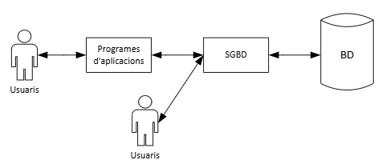
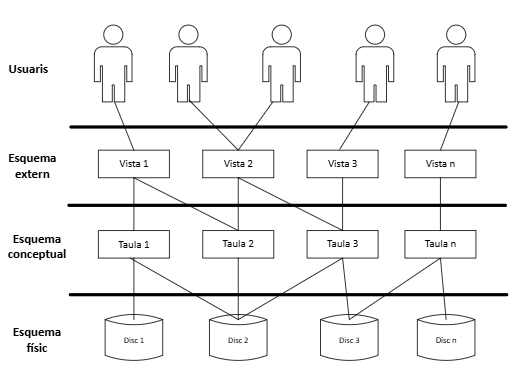
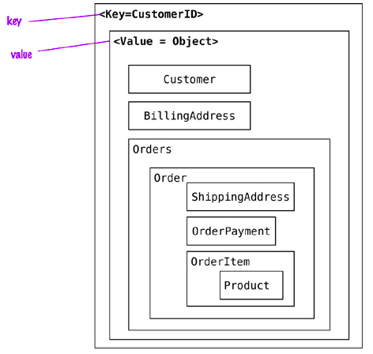
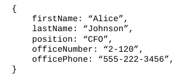
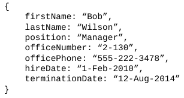

# Introducció als sistemes gestors de bases de dades
Actualment, la informació és un dels actius més valuosos per a moltes empreses, per això han anat proliferant les empreses que comercien amb les nostres dades i, sense adonar-nos, cada cop més, la majoria d'empreses tecnològiques els recopilen en allò que s'anomena empremta digital. Al mòdul de Gestió de Bases de Dades es va veure què són les dades, la diferència amb la informació i per què és important gestionar-les adequadament, i d'aquesta gestió sorgeix l'origen de les bases de dades. Les eines que ens permeten crear i gestionar una base de dades conformen el que és un sistema gestor de bases de dades.

Mitjançant les bases de dades (BD) podem emmagatzemar informació i després recuperar-la de diferents formes, per exemple, inserint registres i després utilitzant consultes a la BD. En aquest curs coneixerem quines eines hi ha darrere; aquestes ens permeten crear una BD, emmagatzemar informació i després realitzar diferents operacions per recuperar les dades de diverses maneres.

Començarem veient què és un sistema gestor de bases de dades (SGBD), i quines són les seues funcions, la seua estructura interna i els seus components. També analitzarem l'arquitectura, els diferents tipus d'SGBD i les característiques, i triarem el tipus d'SGBD més apropiat en cada cas.

## Definició d'un SGBD
Un **SGBD** (en anglés DBMS *Database Management System*) és una eina software que permet als usuaris **definir**, **crear**, **administrar**, **manipular** i **mantindre** bases de dades, proporcionant-les d'un accés controlat. Aquesta eina software pot estar formada per més d'una aplicació. Els SGBD van sorgir de la necessitat d'administrar i gestionar les BD; per això, actualment al mercat podem trobar-nos amb diversos tipus de SGBD, amb distintes característiques, arquitectura i funcions.

La principal característica dels SGBD és que proporcionen als usuaris cert nivell d'abstracció de les dades; és a dir, l'usuari de la BD no té per què conèixer, per exemple, com s'emmagatzemaran les dades al suport físic.

<figure style="align: center;">
    
    <figcaption>Esquema simplificat d'ús d'un SGBD</figcaption>
</figure>

## Arquitectura d'un SGBD
El concepte d'arquitectura d'un SGBD té que veure amb la separació de les dades respecte els programes que els gestionen i manipulen. Quan sorgire els primers programes de gestió, les dades estaven fortament lligades al programa d'aplicació que els manipulava. Per aquest motiu, a 1975 el comité **ANSI-SPARC** va proposar una arquitectura amb tres nivells d'abstracció, què garanteix la independència física i lògica de les dades. Aquests nivells són els següents: **nivell intern o físic**, **nivell conceptual** i **nivell extern**.

La **independència física** és la capacitat de realitzar canvis a l'esquema intern sense necessitat de tindre que modificar l'esquema conceptual o externs.

La **independència lògica** és la capacitat de poder canviar l'esquema conceptual sense tindre que modificar els esquemes externs.

El **nivell intern o físic** està relacionat amb l'emmagatzematge físic; representa la manera en la qual estan emmagatzemats les dades. Descriu l'estructura física de la BD mitjançant un **esquema intern**, què especifica els detalls de com s'emmagatzemen físicament les dades: els arxius que contenen la informació, com estan organitzats, els mètodes d'accés als registres, els tipus de registres, la longitud, els camps que els composen, etc.

El **nivell extern** o de visió és el nivell on interactuen els usuaris o grups d'usuaris; per tant, es descriuen diversos **esquemes externs** o **vistes d'usuaris** amb la visió individual de la BD de cadascun d'ells.

El **nivell conceptual** representa la informació continguda en la BD; dissenya l'estructura de tota la BD per a un conjunt d'usuaris de la mateixa organització, mitjanánt un **esquema conceptual**. Aquest esquema descriu entitats, atributs, relacions, operaciones dels usuaris i restriccions, ocultant els detalls de les estructures físiques d'emmagatzematge.

<figure style="align: center;">
    
    <figcaption>Arquitectura ANSI/SPARC d'un SGBD</figcaption>
</figure>

## Components
Els SGBD compten amb els següents components bàsics:

- **Diccionari de dades**. Compté tota la informació que descriuen les dades de la nostra BD; aquesta informació també s'anomena metadades. El diccionari de dades està format per dades sobre les dades, com a nom de taules, tipus de dades de les seues columnes, noms de bases de dades, restriccions...
- **Llenguatge de definició de dades (DDL)**. S'utilitza per a implementar l'esquema conceptual i intern de la BD. És a dir, els objectes (taules o vistes) de la BD, la seua estructura, les seues relacions i les seues restriccions.
- **Llenguatge de manipulació de dades (DML)**. Proporciona un mecanisme per a inserir, actualitzar i esborrar la informació continguda a la BD.

Als SGBD relacionals, el llenguatge estàndar que s'utilitza és l'SQL (*Structured Query Language*), què té instruccions de definició i manipulació de dades.

Els SGBD disposen d'altres components com ara els següents:

- **Control de dades redundants**. Estableix una sèrie de condicions perquè les dades no estiguen repetides de manera descontrolada i afavorisca la consistència d'aquestos, facilitant el seu manteniment.
- **Restriccions d'accés**. Per garantir que tan sols les persones autoritzades puguen accedir a les dades que les corresponguen.
- **Garantir la integritat**. Controla que les dades emmagatzemades siguen coherents amb altres dades amb els que tinguen relació.
- **Recuperació de dades**. Permet realitzar còpies de seguretat de la BD i restablir-les en cas de necessitat.
- **Control d'accessos concurrents**. Gestiona que diversos usuaris puguen accedir al mateix temps a les mateixes dades de manera segura.
- **Gestionar transaccions**. Aquesta funció està lligada a la de garantir la integritat, ja que totes les transaccions dependents o relacionades entre sí es realitzen totes o cap. Les instruccions més delicades són les que provoquen canvis a la BD.
- **Optimitzador de consultes**. Busca la millor estratègia per a executar les consultes.
- **Planificador**. Permet automatitzar i programar tasques.

## Tipus de SGBD
Igual que la música, les bases de dades es poden classificar en un o més estils. Una cançó individual pot compartir totes les mateixes notes amb altres cançons, però algunes són més adequades per a determinats usos.

### Relacional
El model relacional és generalment el que ens ve al cap a la majoria de persones amb experiència en BD. Els SGBD relacionals (RDBMS) són sistemes basats en la teoria de conjunts implementats com a taules bidimensionals amb files i columnes. El mitjà canònic d'interactuar amb un RDBMS és escriure consultes en SQL. Els valors de les dades s'escriuen i poden ser numèrics, cadenes, dates, blobs no interpretats o altres tipus. Els tipus són forçats pel sistema. És important destacar que les taules es poden unir i transformar en taules noves i més complexes fent ús d'operacions basades a l'àlgebra relacional.

Els RDBMS continuen utilitzant-se a gran multitud de sistemes d'informació, i incideixen en la consistència i integritat de les dades.

Exemples: Oracle Database, SQL Server, PostgreSQL, MySQL, MariaDB.

### NoSQL
El terme NoSQL (*Not only SQL*) són SGBD amb dades que no segueixen el model relacional. Aquests SGBD prioritzen l'escabilitat i la disponibilitat en lloc de la integritat de les dades.

Hi han diversos tipus de BD NoSQL. Ací ens centrarem als de clau-valor i als basats en documents.

#### Clau-valor
Les bases de dades de clau-valor (KV *Key-Values*) és el model més senzill NoSQL. Com el seu nom indica, una BD KV emparella claus amb valors de la mateixa manera que ho faria un mapa (o una taula hash) en qualsevol llenguatge de programació popular. 

El seu funcionament és similar a una taula relacional de dos columnes, per exemple, id i nom, on id actua com a clau i nom com a valor. En una BD clau-valor el valor pot ser una dada simple o un objecte binari.

Aquests SGBD només permeten consultar les dades mitjançant la clau sense tindre coneiximent del tipus de dades que té el valor.

Degut que els requisits exigits són mínims, estos SGBD poden tindre un rendiment increïble en una gran varietat d'escenaris, però no són útils quan es tenen necessitats complexes de consultes i agregació.

<figure style="align: center;">
    
    <figcaption>Representació d'un magatzem clau-valor</figcaption>
</figure>

Els SGBD clau-valor s'utilizen en una àmplia gama d'aplicacions, com ara:

- Emmagatzament cau (caché) de dades de BD relacionals per millorar el rendiment.
- Seguiment d'atributs transitoris d'una aplicació web, com per exemple un carret de la compra.
- Emmagatzament d'informació de dades d'usuari i configuració per a aplicacions mòbils.
- Emmagatzament d'objectes grans, com ara imatges i arxius d'audio.

Exemples: Redis, Valkey, Memcached, Amazon DynamoDB, Amazon MemoryDB, Azure CosmosDB.

#### Basades en documents
Les BD basades en documents es poden veure com una extensió de les BD clau-valor. Aquest tipus de BD emmagatzema els valors com a entitats semiestructurades anomenades documents, normalment en un format estàndard com la notació d'objectes JavaScript (JSON), o representació binàries d'aquest.

El benefici principal d'utilitzar una BD de documents prové del fet que no està limitat a fer consultes només per clau, al contrari que les BD clau-valor. Les dades deixen de ser opaces de manera que la BD podrà realitzar treball addicional sense haver de traduir les dades a un format que comprengui.

Els documents s'agrupen en col·leccions o bases de dades, depenent del sistema, cosa que permet agrupar documents.
Els documents contenen un o més camps, on cada camp conté un valor amb un tipus, ja sigui cadena, sencer, flotant, data, binari o array o un altre document.

<figure style="align: center;">
    
    <figcaption>Document en format JSON</figcaption>
</figure>

Una de les característiques més importants de les BD de documents és que no cal definir un esquema fix abans d'afegir dades a la BD. Simplement en afegir un document a la BD es creen les estructures de dades subjacents necessàries per recolzar el document. La manca d'un esquema fix brinda als desenvolupadors més flexibilitat amb les BD de documents que amb les BD relacionals.

<figure style="align: center;">
    
    <figcaption>Document amb camps distints</figcaption>
</figure>

Aquests SGBD són adequats per a una gran varietat de casos d'ús, incloent:

- Suport de backend per a llocs web amb gran volum de lectures i escriptures.
- Gestió de tipus de dades amb atributs variables, com per exemple productes.
- Seguiment de tipus variables de metadades.
- Aplicacions que utilitzen estructures de dades JSON.

Exemples: MongoDB, CouchDB, Amazon DocumentDB, Amazon DynamoDB, Azure CosmosDB.

## Exercici
Criteris d'avaluació 1a, 1b, 1c, 1d, 1e.

- Tens 20 minuts per a empapar-te fent ús dels recursos que consideres sobre les avantatges i inconvenients dels 3 tipus de SGBD vists a la teoria. A continuació el professor dirigirà un debat on hauràs de raonar davant qüestions sobre les situacions on seria convenient fer ús d'un o un altre tipus. 

